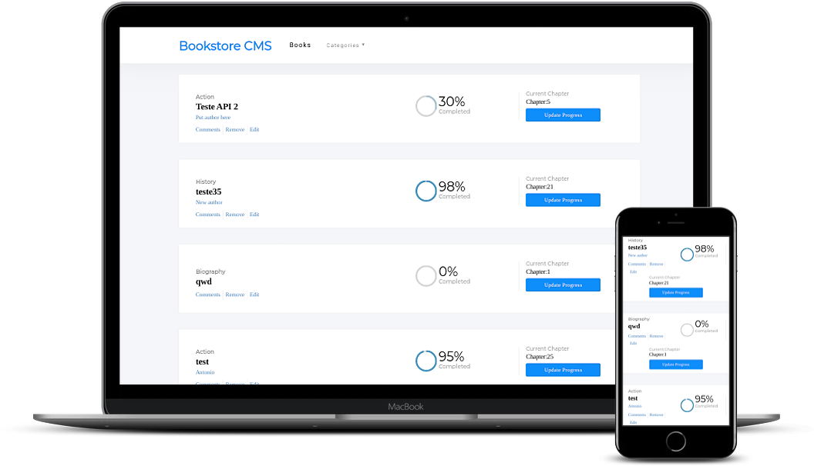

# Bookstore App - API

An app that allow users to insert and update prgress of books. The purpose of the entire project is to work with a full-stack ( ruby on rails and react).
This is just the API

## Built With

- Ruby
- Ruby on Rails Framework
- Rspec

## Getting Started

Open the [Live Demo Link](antoniobookapi.herokuapp.com/books) .

## Author

👤 António Fernandes

[Github](https://github.com/trox115) | [Twitter](https://twitter.com/rock_67)

## 🤝 Contributing

Contributions, issues and feature requests are welcome!

Feel free to check the issues page.

Need More Work:

- Write more tests

## Show your support

Give a star ⭐️ if you like this project!

# Required Installations

If you want a copy of this project running on your machine you have to install:

- Ruby 2.6.3
- Rails 6.0.2.2

For installation instructions follow [The Instalation Guide](https://www.tutorialspoint.com/ruby-on-rails/rails-installation)

# Instalation of This App

Once you have installed the requiered packages shown on the [Required Installations](), proceed with the following steps

Clone the Repository, the folder bookstoreApi will be downloaded

```Shell
your@pc:~$ git clone https://github.com/trox115/bookstoreApi.git
```

Move to the downloaded folder

```Shell
your@pc:~$ cd bookstoreApi
```

install gems

```Shell
your@pc:~$ bundle install --without production
```

migrate the database

```Shell
your@pc:~$ rails db:create
your@pc:~$ rails db:migrate
```

Finally, run the test suite to verify that everything is working correctly:

```Shell
your@pc:~$ rspec
```

If the test suite passes, you'll be ready to run the app in a local server:

If you desire to create dummy data to see the apps functionallity run

```Shell
your@pc:~$ rails db:seed

```

it will create Books

```Shell
your@pc:~$ rails server -p 3001

```

Then, go to [http://localhost:3001/](http://localhost:3001/)

Voila!

You have the backend running.

## Warning - You need the frontend for the entire app to work.

You can get it [here](https://github.com/trox115/bookstore)

## Barber App Features - FrontEnd and API

To view the live demo click the [link](antoniobookapi.herokuapp.com/books) and you will be taken to the bookstorepage



### License

This project is MIT licensed.
